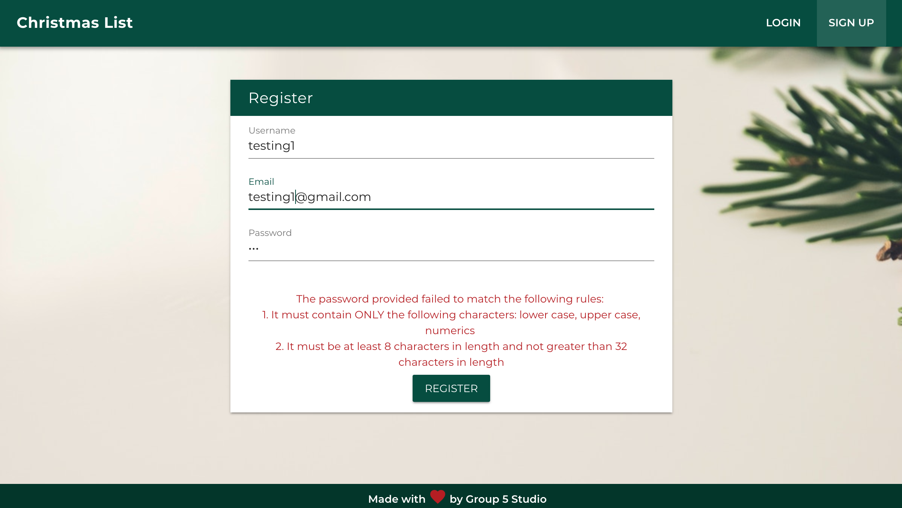
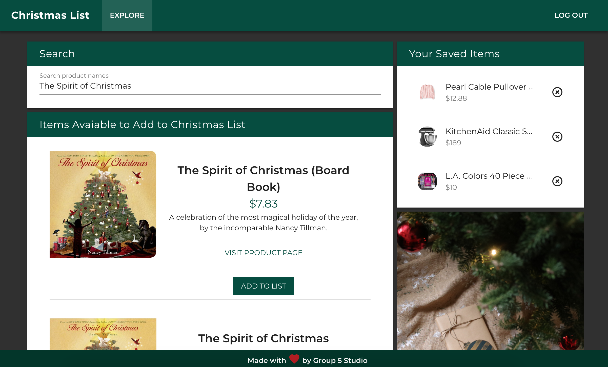

# Christmas List

#### A `Vue.js` / `Express.js` web application for creating a Christmas list by searching items they wish to get from `Walmart API` and save those items to a list on `MySQL` Database. This app also have `User Authentication` for registration and login powered by `Passport` and `JSON Web Tokens (JWTs)`
---
A working version of the application can be found at [https://tbl-christmas-wishlist.herokuapp.com/](https://tbl-christmas-wishlist.herokuapp.com/  "Christmas List")

A presentation file can be found at [Christmas List by Group 5 Studio on Canva](https://www.canva.com/design/DADKkFeuvAs/iMZtkdK9FR4Ow6Wzv0ntqw/view?utm_content=DADKkFeuvAs&utm_campaign=designshare&utm_medium=link&utm_source=sharebutton)'

---
## The Motivation for Development

As the gift-giving time of the year is approaching, we would like to help people give and get the gifts that matter most.
* **For those who love gift-giving**: Keep yourself and family happy with a home filled with thoughtful gifts
* **For consumer**: Prevent impulse buys and overspending when there are big sales everywhere
* **For the Holiday Spirit**: Take agains buying for the sake of buying

---
## Product features

* **Christmas List** is a single page application that allows the user to create a list of gifts they wish to receive.

* The user can register their `username`, `email address`, and `password` following these validation rules:
    * `Username` must be at least 3 characters in length and not greater than 30 characters in length.
    * `Username` must contain only letters and numbers. No special characters.
    * `Password` must contain ONLY the following characters: lower case, upper case, numerics.
    * `Password` must be at least 8 characters in length and not greater than 32 characters in length.
* If the account is created, the user can log in to their Christmas list. Once logged in, the app will automatically syncs its `store` data with `local storage` so it will remember the user even when the user refresh the page.

* The user can seach for items they want to include in their list using the search panel. 
* The user can add or remove the item from their saved items list.

---
## Technologies Used

#### Front End / UI
| Front End Dependencies  | Description |
| ------------- | ------------- |
| `Vue.js`  | `Vue` (pronounced /vjuː/, like view) is a progressive framework for building user interfaces.   |
| `vuex`  | Centralized State Management for Vue.js. |
| `vuetify`  | Vuetify is a semantic component framework for Vue. |
| `vuex-persistedstate`  | Persist and rehydrate your Vuex state between page reloads.  |
| `vuex-router-sync` | Sync vue-router's current $route as part of vuex store's state.  |
| `axios` | Promise based HTTP client for the browser and node.js  |
| `lodash`  | Lodash makes JavaScript easier by taking the hassle out of working with arrays, numbers, objects, strings, etc.  |

#### Back End
| Back End Dependencies  | Description |
| ------------- | ------------- |
| `Express.js`  | A web framework for Node.js providing robust routing and HTTP helpers (redirection, caching, etc)  |
| `mysql2` |  A MySQL library serving the extremely common use-case of connecting, querying and iterating on results |
| `sequelize`  | A promise-based Node.js ORM for Postgres, MySQL, SQLite and Microsoft SQL Server |
| `body-parser` | All middlewares will populate the req.body property with the parsed body.  |
| `cors`  | CORS is a node.js package for providing a `Connect/Express` middleware that can be used to enable CORS with various options.  |
| `passport` | Passport is Express-compatible authentication middleware for Node.js. |
| `passport-jwt` | A Passport strategy for authenticating with a JSON Web Token. This module lets you authenticate endpoints using a JSON web token. It is intended to be used to secure RESTful endpoints without sessions.  |
| `bcrypt-nodejs` | Native JS implementation of BCrypt for Node. We use this code to hash password.  |
| `jsonwebtoken` | An implementation of JSON Web Tokens |
| `joi` | Object schema description language and validator for JavaScript objects. |
| `morgan` | HTTP request logger middleware for node.js |

---
## Direction for Future Development
* Let people to discover a list by name, email, or link
* Avoid duplicate gifts by having people mark a list item as reserved
* Add more API endpoints that the user can include products/services from their favorite stores
* Suggest gift ideas based on people who save similar items
* Count how many days until Christmas

---
## Authors
**Group 5 Studio Team Members**
* [Victor Adams](https://kysper.github.io/)
* [Tim Lukens](https://timlukens.com/)
* [Micah Walker](https://mjwalker99.github.io/Updated-Portfolio/)
* [Keen Wilson](https://keenwilson.com)

_This group project is part of the Full-Stack Web Development program at University of Kansas_
